<a href="https://github.com/areebfazli">
  <picture>
    <source media="(prefers-color-scheme: dark)" srcset="./assets/banner-dark.svg" />
    <source media="(prefers-color-scheme: light)" srcset="./assets/banner-light.svg" />
    
  </picture>
</a>

  <a href="https://linkedin.com/in/areebfazli"><picture><source media="(prefers-color-scheme: dark)" srcset="./assets/btn-linkedin-dark.svg" /><source media="(prefers-color-scheme: light)" srcset="./assets/btn-linkedin-light.svg" />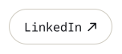</picture></a><a href="mailto:areeb.fazli@outlook.com"><picture><source media="(prefers-color-scheme: dark)" srcset="./assets/btn-email-dark.svg" /><source media="(prefers-color-scheme: light)" srcset="./assets/btn-email-light.svg" />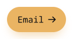</picture></a><picture><source media="(prefers-color-scheme: dark)" srcset="./assets/btn-location-dark.svg" /><source media="(prefers-color-scheme: light)" srcset="./assets/btn-location-light.svg" />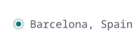</picture>

 

<picture>
  <source media="(prefers-color-scheme: dark)" srcset="./assets/h-about-dark.svg" />
  <source media="(prefers-color-scheme: light)" srcset="./assets/h-about-light.svg" />
  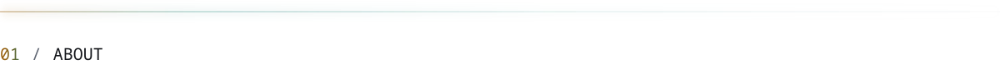
</picture>

I'm an ML/AI engineer specialising in **RAG, retrieval, LLM orchestration and AI evaluation**. I build end-to-end AI systems where retrieval quality is measured, answers are grounded in evidence, and the system abstains when the evidence isn't there.

<picture>
  <source media="(prefers-color-scheme: dark)" srcset="./assets/about-timeline-dark.svg" />
  <source media="(prefers-color-scheme: light)" srcset="./assets/about-timeline-light.svg" />
  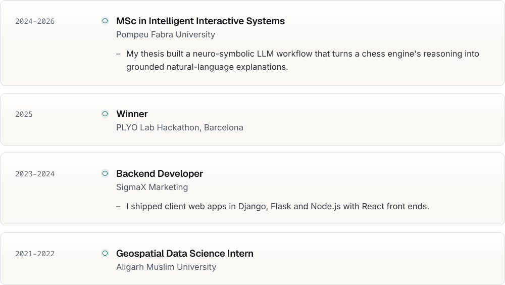
</picture>

<a href="https://doi.org/10.1007/978-981-96-7963-8_10"><picture><source media="(prefers-color-scheme: dark)" srcset="./assets/about-publication-dark.svg" /><source media="(prefers-color-scheme: light)" srcset="./assets/about-publication-light.svg" />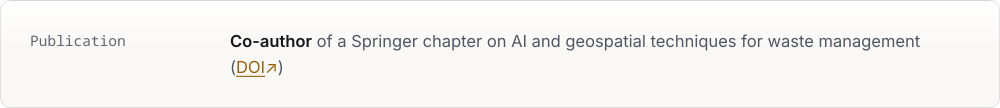</picture></a>

 

<picture>
  <source media="(prefers-color-scheme: dark)" srcset="./assets/h-projects-dark.svg" />
  <source media="(prefers-color-scheme: light)" srcset="./assets/h-projects-light.svg" />
  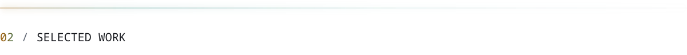
</picture>

<table>
<tr>
<td width="50%" valign="top">

<a href="https://github.com/areebfazli/rag_search"><picture><source media="(prefers-color-scheme: dark)" srcset="./assets/card-rag_search-dark.svg" /><source media="(prefers-color-scheme: light)" srcset="./assets/card-rag_search-light.svg" />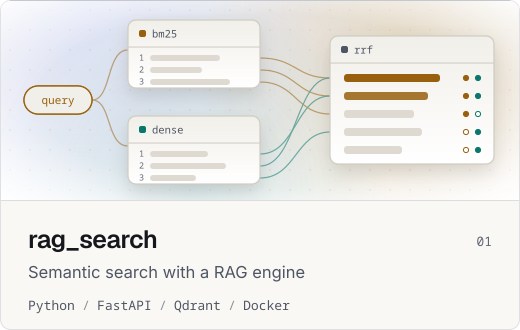</picture></a>

A hybrid search API over BEIR/SciFact that fuses BM25 and dense embeddings in Qdrant with Reciprocal Rank Fusion, then generates cited, evidence-grounded answers or abstains.

<picture><source media="(prefers-color-scheme: dark)" srcset="./assets/rag-metrics-dark.svg" /><source media="(prefers-color-scheme: light)" srcset="./assets/rag-metrics-light.svg" />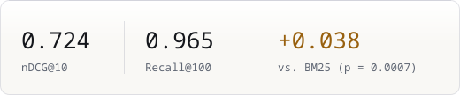</picture>

- Reranking was left off by default because it added roughly 160× latency for no meaningful quality gain.
- An LLM-as-judge evaluation checks answer/abstain verdicts against gold relevance labels, so abstention is measured rather than assumed.

</td>
<td width="50%" valign="top">

<a href="https://github.com/areebfazli/repo_sentinel"><picture><source media="(prefers-color-scheme: dark)" srcset="./assets/card-repo_sentinel-dark.svg" /><source media="(prefers-color-scheme: light)" srcset="./assets/card-repo_sentinel-light.svg" />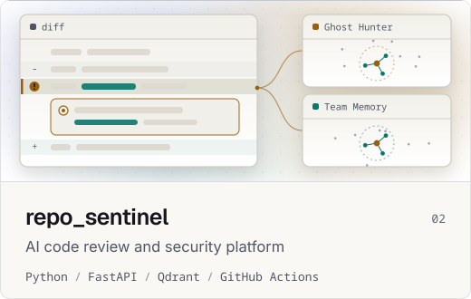</picture></a>

An AI security reviewer for pull requests. It parses changed functions with tree-sitter and retrieves evidence from a CVE corpus and from the team's past review discussions. It keeps only findings that quote the offending code, then posts deduplicated inline comments through a GitHub Action.

- **Ghost Hunter** matches changed code against known CVE patterns.
- **Team Memory** recalls how your team reviewed similar code before.
- It includes a FastAPI backend, a web dashboard, and a GitHub Action that comments on PRs.

</td>
</tr>
<tr></tr>
<tr>
<td width="50%" valign="top">

<a href="https://github.com/areebfazli/find_waldo"><picture><source media="(prefers-color-scheme: dark)" srcset="./assets/card-find_waldo-dark.svg" /><source media="(prefers-color-scheme: light)" srcset="./assets/card-find_waldo-light.svg" />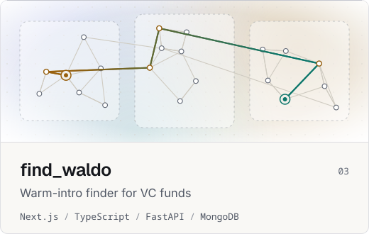</picture></a>

It won the PLYO Lab Hackathon (2025) and was built by a team of three in under 48 hours. Partners upload their LinkedIn connections, and founders ask *"who can intro me to X at Y?"* to get ranked warm-introduction paths across the fund's portfolio.

</td>
<td width="50%" valign="top">

<a href="https://github.com/areebfazli/football_prediction"><picture><source media="(prefers-color-scheme: dark)" srcset="./assets/card-football_prediction-dark.svg" /><source media="(prefers-color-scheme: light)" srcset="./assets/card-football_prediction-light.svg" />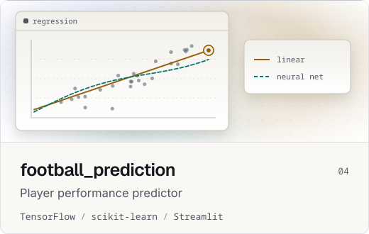</picture></a>

A Streamlit app that predicts a player's next-season goals and assists. It compares hand-implemented linear regression (normal equation and gradient descent) with tuned neural networks.

</td>
</tr>
</table>

 

<picture>
  <source media="(prefers-color-scheme: dark)" srcset="./assets/h-stack-dark.svg" />
  <source media="(prefers-color-scheme: light)" srcset="./assets/h-stack-light.svg" />
  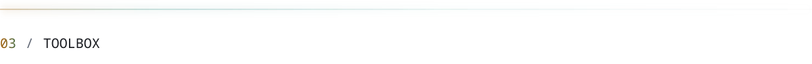
</picture>

<picture>
  <source media="(prefers-color-scheme: dark)" srcset="./assets/stack-skills-dark.svg" />
  <source media="(prefers-color-scheme: light)" srcset="./assets/stack-skills-light.svg" />
  
</picture>

<picture>
  <source media="(prefers-color-scheme: dark)" srcset="./assets/footer-dark.svg" />
  <source media="(prefers-color-scheme: light)" srcset="./assets/footer-light.svg" />
  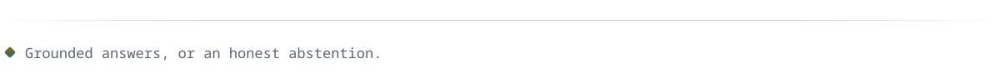
</picture>
